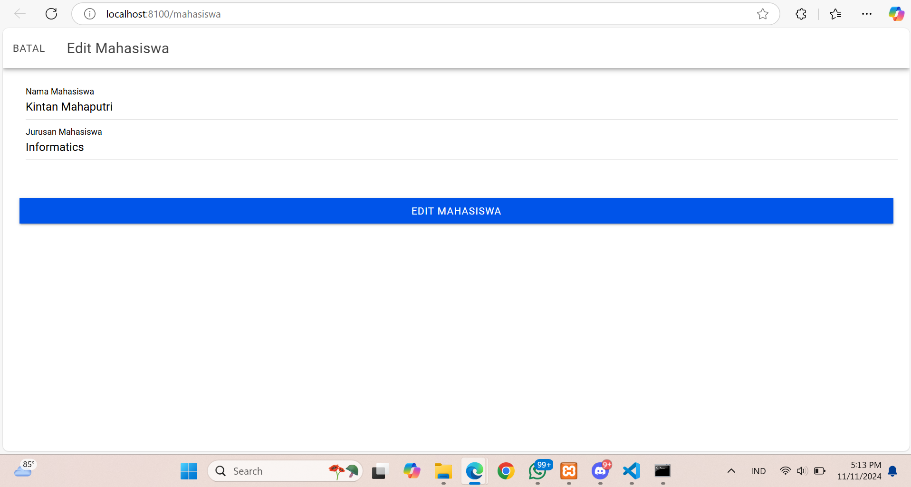

# PrakMobile_Kintan-Kinasih-Mahaputri_ionic3

Nama : Kintan Kinasih Mahaputri
NIM : H1D022019
Shift : A

Pertama, buat database dan tabel mahasiswa di MySQL. Buatlah database dengan nama db_mhs. Setelah itu, di dalam database tersebut, buat tabel `mahasiswa` yang memiliki kolom-kolom seperti id, nama, dan jurusan, untuk menyimpan informasi mahasiswa.

Selanjutnya, buat API dengan menggunakan PHP agar aplikasi dapat berinteraksi dengan database. File koneksi.php bertanggung jawab menyediakan koneksi ke database db_mhs. Untuk mengambil seluruh data mahasiswa, buat file tampil.php yang menampilkan data dalam format JSON. Untuk menambahkan data baru, buat file tambah.php. Jika ingin mengambil data berdasarkan id tertentu, gunakan lihat.php, sedangkan untuk menghapus data berdasarkan id, gunakan hapus.php. Untuk mengedit data mahasiswa yang sudah ada, buat file edit.php.

Kemudian, siapkan proyek di Ionic sebagai antarmuka aplikasi. Mulailah dengan membuat proyek baru menggunakan perintah ionic start crud_mhs. Setelah proyek siap, buat halaman utama untuk menampilkan data mahasiswa dan fungsi CRUD. Tambahkan juga file api.service.ts yang berfungsi sebagai layanan API untuk menghubungkan aplikasi Ionic dengan API PHP yang sudah dibuat.

Setelah itu dapat menampilkan data Mahasiswa:

Pada file mahasiswa.page.ts, buat fungsi getMahasiswa() yang bertanggung jawab mengambil seluruh data mahasiswa dari API tampil.php dan menampilkannya di aplikasi. Fungsi ini akan memanggil API untuk mendapatkan data yang kemudian ditampilkan kepada pengguna.

Di file mahasiswa.page.html, buat tampilan dalam bentuk kartu yang menampilkan informasi setiap mahasiswa. Setiap kartu akan menampilkan nama dan jurusan mahasiswa, sehingga pengguna dapat melihat data dengan mudah dan terstruktur.

Setelah itu kita bisa menambahkan data mahasiswa

Di file mahasiswa.page.ts, buat fungsi openModalTambah() yang akan membuka sebuah modal berisi form untuk menambah data mahasiswa baru. Ketika pengguna mengisi form dan menyimpan data, fungsi `tambahMahasiswa()` akan mengirim data baru tersebut ke API `tambah.php` untuk disimpan ke database.

Pada file mahasiswa.page.html, tampilkan tombol "Tambah Mahasiswa" yang, saat diklik, akan membuka modal input data. Modal ini berfungsi sebagai tempat bagi pengguna untuk memasukkan informasi mahasiswa baru sebelum data tersebut dikirim ke API.

Kita bisa menghapus data mahasiswa yang sudah terinput

Pada file mahasiswa.page.ts, buat fungsi hapusMahasiswa(id) yang berfungsi untuk menghapus data mahasiswa berdasarkan id tertentu. Fungsi ini akan memanggil API hapus.php untuk menghapus data mahasiswa yang sesuai dari database.

Di file mahasiswa.page.html, tambahkan tombol "Hapus" pada setiap kartu data mahasiswa. Tombol ini memungkinkan pengguna untuk menghapus data mahasiswa langsung dari tampilan, sehingga mempermudah pengelolaan data.

Pada file mahasiswa.page.ts, tambahkan fungsi openModalEdit() yang berfungsi untuk membuka sebuah modal dengan form yang memungkinkan pengguna mengedit data mahasiswa yang dipilih. Ketika pengguna memilih mahasiswa untuk diedit, modal ini akan menampilkan data mahasiswa tersebut dalam form yang dapat diubah sesuai kebutuhan.

Setelah pengguna selesai mengedit data dan menyimpannya, fungsi editMahasiswa() akan mengirim data yang telah diperbarui ke API edit.php. API ini akan memproses perubahan dan menyimpan data terbaru ke database, menggantikan data lama.

Di file mahasiswa.page.html, tambahkan tombol "Edit" pada setiap kartu data mahasiswa. Tombol ini memungkinkan pengguna untuk membuka modal form edit. Dengan modal ini, pengguna bisa memperbarui informasi mahasiswa secara langsung, menjadikan proses pengeditan lebih intuitif dan efisien.
